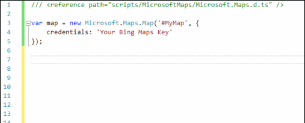
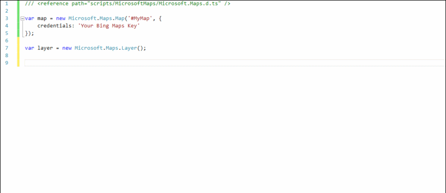
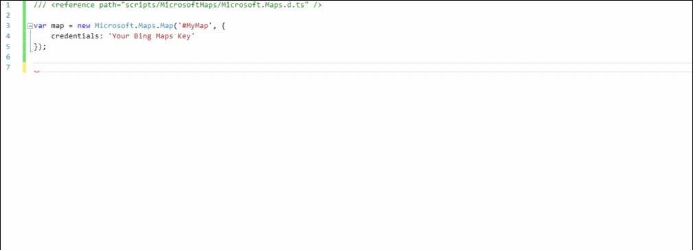

 

#Bing Maps V8 TypeScript Definitions

These are the official TypeScript definitions for the [Bing Maps V8 Web Control](https://msdn.microsoft.com/en-US/library/mt712542.aspx). These can be used to provide intellisense and richer error catching functionality to your IDE.



## How to get the definitions

**Use the NuGet Package**

Using the [Bing Maps V8 TypeScript Definitions NuGet package](https://www.nuget.org/packages/Microsoft.BingMaps.V8.TypeScript/) will make it easy to both add the definitions to your project and to also keep them up to date. 

If using Visual Studio, oepn the nuget package manager, select the Browse tab and seearch for "Bing Maps V8". This should reduce the list of results enough to fine the "Bing Maps V8 TypeScript Defintions" package. The owner of the package is bingmaps.

Alternatively, if you are using the nuget commandline:

```
PM>  Install-Package Microsoft.BingMaps.V8.TypeScript
```

**Install npm package**

Using the [Bing Maps V8 TypeScript npm package](https://www.npmjs.com/package/bingmaps) is another easy way to add the definitions to your project and keep them up to date. 

```
npm install -g bingmaps
```

**Download definitions**

Simply press the download button for this repository. Unzip the downloaded file, and copy the the scripts folder into your project. Note that you will need to do this processagain from time to time if you want to have the most recent definitions. This should only be needed if you want to use newer features or if bugs in the definitions have been corrected.

## Usage

If using Visual Studio, you can add a reference to the core Bing Maps V8 functionality by adding the following to the top of your TypeScript file. 

```
/// <reference path="scripts/MicrosoftMaps/Microsoft.Maps.d.ts" />
```
If you want to also use some of the Bing Maps modules, you can either update the above reference to the following:

```
/// <reference path="scripts/MicrosoftMaps/Microsoft.Maps.All.d.ts" />
```

or you can add a reference to the individual module definitions.

| Module                                                                          | Path                                                     |
|---------------------------------------------------------------------------------|----------------------------------------------------------|
| [Autosuggest](https://msdn.microsoft.com/en-us/library/mt712650.aspx)           | scripts/MicrosoftMaps/Modules/Autosuggest.d.ts           |
| [Clustering](https://msdn.microsoft.com/en-us/library/mt712807.aspx)            | scripts/MicrosoftMaps/Modules/Clustering.d.ts            |
| [Directions](https://msdn.microsoft.com/en-US/library/mt748655.aspx)            | scripts/MicrosoftMaps/Modules/Directions.d.ts            |
| [Drawing Tools](https://msdn.microsoft.com/en-us/library/mt750543.aspx)         | scripts/MicrosoftMaps/Modules/DrawingTools.d.ts          |
| [GeoJson](https://msdn.microsoft.com/en-us/library/mt712806.aspx)               | scripts/MicrosoftMaps/Modules/GeoJson.d.ts               |
| [Heat Map Layer](https://msdn.microsoft.com/en-us/library/mt712868.aspx)        | scripts/MicrosoftMaps/Modules/HeatMapLayer.d.ts          |
| [Search](https://msdn.microsoft.com/en-us/library/mt712846.aspx)                | scripts/MicrosoftMaps/Modules/Search.d.ts                |
| [Spatial Data Services](https://msdn.microsoft.com/en-us/library/mt712849.aspx) | scripts/MicrosoftMaps/Modules/SpatialDataServices.d.ts   |
| [Spatial Math](https://msdn.microsoft.com/en-us/library/mt712834.aspx)          | scripts/MicrosoftMaps/Modules/SpatialMath.d.ts           |
| [Traffic](https://msdn.microsoft.com/en-us/library/mt712860.aspx)               | scripts/MicrosoftMaps/Modules/Traffic.d.ts               |
| [Well Known Text](https://msdn.microsoft.com/en-us/library/mt712880.aspx)       | scripts/MicrosoftMaps/Modules/WellKnownText.d.ts         |

## Screenshots

The following shows the intellisense for events. Notice how a list of the supported events are displayed, thus saving you from having to go back to documentation to verify the correct event name. Also notice how the structure of the event argument is known and you can easily access its properties.



The following shows the intellisense for adding modules. A list of the supported modules appears, saving you from having to go looking for the correct name/spelling used in Bing Maps V8.



## Additional Resources

* [Bing Maps V8 Interactive Code Samples](http://www.bing.com/api/maps/sdk/mapcontrol/isdk)
* [Bing Maps V8 MSDN Documentation](https://msdn.microsoft.com/en-us/library/mt712542.aspx)
* [Bing Maps Blog](http://blogs.bing.com/maps)
* [Bing Maps forums](https://social.msdn.microsoft.com/Forums/en-US/home?forum=bingmapsajax&filter=alltypes&sort=lastpostdesc)
* [Bing Maps for Enterpise site](https://www.microsoft.com/maps/)

## Q & A

- **Q: When will new Bing Maps features be added to these defintions.**
  - **A:** New features will be added to the definitions when they have graduated out of the experimental branch and into the main release branch of V8. This will often be done in parallel with MSDN documentation updates. A list of new features can be found in the release notes [here](https://msdn.microsoft.com/en-US/library/mt770019.aspx).

## Contributing

We welcome contributions. Feel free to file issues and pull requests on the repo and we'll address them as we can. Learn more about how you can help on our [Contribution Rules & Guidelines](CONTRIBUTING.md). 

You can reach out to us anytime with questions and suggestions using our communities below:
* [MSDN Forums](https://social.msdn.microsoft.com/Forums/en-US/home?forum=bingmapsajax&filter=alltypes&sort=lastpostdesc)
* [StackOverflow](http://stackoverflow.com/questions/tagged/bing-maps)

This project has adopted the [Microsoft Open Source Code of Conduct](https://opensource.microsoft.com/codeofconduct/). For more information, see the [Code of Conduct FAQ](https://opensource.microsoft.com/codeofconduct/faq/) or contact [opencode@microsoft.com](mailto:opencode@microsoft.com) with any additional questions or comments.

## License

MIT
 
See [License](LICENSE.md) for full license text.
